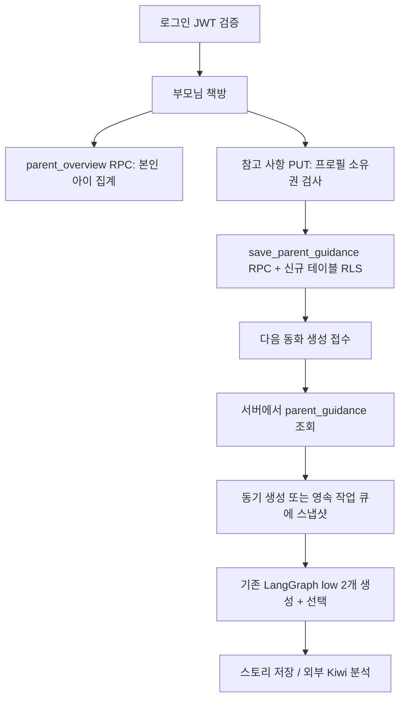

# 부모님 책방·대시보드·종이인형극 구현 (2026-09-18)

## 사용자 동작

- 대시보드: 현재 단계 안의 진척도를 `45%`처럼 숫자로 표시. 기존 서버 level의 소수부 계산과 최고 단계 100% 규칙을 재사용한다.
- 재측정: 상시 하루 1회 문구 삭제. 서버 `measured_today`가 true면 버튼을 aria-disabled로 비활성화한다. 버튼 포커스/마우스/터치 시 설명을 절대 위치로 겹쳐 표시한다. API의 KST 하루 1회 제한도 유지한다.
- 어두운 목재 책장: 짙은 배경과 밝은 선반 전면, 옅은 상태 글씨. 목재는 CSS로 표현하여 별도 이미지 전송이 없다.
- 동화 생성: 공유 StoryGenerationCard 안에 해·달·도깨비·호랑이·파도 종이인형극. 서버 stage 문구를 유지하며 임의 진행률은 표시하지 않는다. 다섯 WebP 총 161,286 bytes. hidden 탭/화면 밖/완료/실패에서는 정지, 사용자 정지 버튼과 prefers-reduced-motion 지원. 고정 높이와 contain:layout paint로 레이아웃 흔들림 방지.
- 마지막 장: 퀴즈가 있으면 문제 풀기 및 이전 책장 버튼. 퀴즈가 없으면 이전 책장 버튼. 분석 기능은 그 아래 작은 회색 밑줄 버튼이다. 분석 준비 중 문구에서 준비 완료 시 확인하기로 바뀐다. 기존 제한된 폴링·오류 재시도·대화상자를 유지한다.
- 다시 열기: 서버/미저장 로컬 책갈피가 ending이고 완독 기록이 있으며, 문제 완료 또는 문제가 없는 책이면 cover로 시작한다. 문제를 안 푼 책은 ending을 유지하고 다시 읽던 중간 위치는 새로고침해도 복원한다.

## 부모님 고정 프로필

프로필 선택 화면에 삭제 불가능한 `부모님` 진입점을 제공한다. 아이의 생년월일/레벨을 가진 가짜 profiles 행을 만들지 않는다. 로그인 계정 하나에 항상 하나의 부모님 역할이 존재하며 아이가 없어도 /parent로 들어갈 수 있다. 앱 프로필 메뉴에도 진입점을 추가했다.

현재 버전은 동일 계정 내의 관리 모드이며, 아이와 부모를 분리하는 PIN/별도 로그인 잠금은 없다. 서버는 검증된 JWT 계정의 자녀만 조회·수정한다.

### 관리 화면

아이별 읽기 단계/진척도, 만든 동화 수, 완독 동화 수, 문제까지 푼 동화 수, 최근 결과지 5건, 영역별 풀이 기록, 맞춤 참고 사항을 제공한다.

영역별 현황은 최근 30회 중 skill과 boolean is_correct가 있는 문항을 합산한 `정답 수 / 푼 문제 수`다. 부모 체크리스트는 제외한다. 기록이 없으면 준비 문구만 표시한다. 정서 발달 검사/진단/또래 백분위로 해석하지 않는다.

참고 사항은 아이별 최대 1,000자. 저장 성공 시에만 저장됨을 표시하고 실패하면 입력을 유지한다. 빈 값으로 저장하면 해제된다. 다음 생성 접수 시에 읽어 작업 request에 스냅샷하고 동기/비동기 모두 같은 story_payload에 포함한다. 진행 중 작업과 기존 책은 바뀌지 않는다. 어휘 단계·안전·응답 구조보다 우선할 수 없다는 최소 프롬프트 한 줄을 추가했다. 기존 low 두 후보 생성/선택과 단계별 규칙은 유지한다.

## DB/API

- 신규 테이블 `parent_story_guidance`: profile_id PK/FK ON DELETE CASCADE, owner_user_id, guidance, updated_at.
- 신규 RPC: parent_overview(), save_parent_guidance(text,text). 인증 사용자만 호출 가능. 직접 쓰기 권한 없음. 소유권은 JWT auth.uid()로 확인하며 타 계정은 거부한다.
- GET /api/v1/parent/overview -> children[]. 동화 원문/이미지/전체 결과 답안은 반환하지 않는다.
- PUT /api/v1/parent/profiles/{profile_id}/guidance -> {profile_id,guidance}.
- reading-progress GET의 progress에 quiz_completed boolean 추가. 본인/해당 책의 저장된 quiz_results 존재 여부다. PUT 응답에는 이 추가 조회를 하지 않아 optional이다.
- /results/...?...from=parent는 부모님 화면으로 돌아간다. 복귀 주소는 고정 allowlist다.
- 기존 users/profiles/saved_stories RLS 설정은 변경하지 않았다. 새 테이블만 보호한다. Render에 Kiwi/로컬 모델/새 프로세스는 추가하지 않았다.

## 운영 반영 순서

1. SQL 20260918_parent_overview.sql의 롤백 통합검증 후 적용.
2. 백엔드 커밋 push -> Render 배포 완료/라우트 확인.
3. 프론트 커밋 push.

새 환경변수는 필요 없다. DB migration이 없으면 부모님 API/다음 동화 접수에서 503이 나므로 반드시 DB를 먼저 반영한다.

## 검증

- DB: 합성 두 계정, 소유 프로필 집계·읽기 수·영역 통계·참고 사항 저장/trim, 타 계정 거부, 길이 제한, RLS 및 anon 거부. 트랜잭션 ROLLBACK.
- Python: parent feature, 인증, 책장 API, 1~20단계 계약, 생성 그래프를 모의 외부 서비스로 검사. 유료 생성 호출 없음.
- 프론트: 타입 검사, 기존 node 테스트, production build.
- Playwright: 합성 로그인만 사용하고 외부 운영 API를 차단. 데스크톱/모바일, tooltip 위치 불변, daily 비활성/활성, 애니메이션 정지/reduced-motion, 부모님 저장/새로고침/결과지 복귀, 완독+문제완료 표지 재열기, 미완료 퀴즈 ending 유지, 분석 pending/ready, 오류 재시도.

프롬프트와 생성 원본 경로는 IMAGE_PROMPTS.md를 참고한다. 스크린샷은 같은 고도화/parent-theatre 폴더에 있다.
