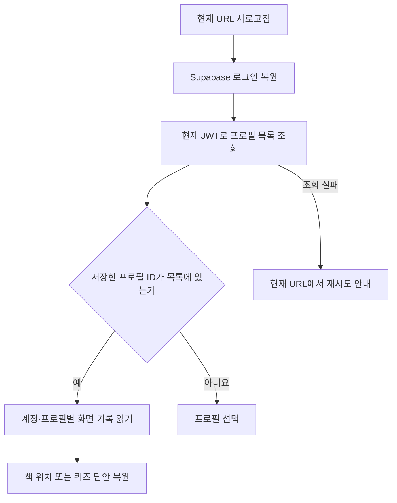

# 새로고침·읽기·퀴즈 진행 복원 (2026-09-17)

## 사용자 동작

- `/dashboard`, `/library`, `/literacy`에서 새로고침하면 로그인 및 서버 프로필 확인이 끝날 때까지 현재 URL에서 기다린다.
- 유효한 선택 프로필을 복원하면 현재 화면을 보여 준다. 로그아웃 상태 또는 서버 목록에 선택 프로필이 없을 때만 `/profiles`로 이동한다.
- 일시적인 조회 실패는 프로필 선택으로 보내지 않고 다시 시도 버튼을 보여 준다.
- 대시보드의 동화 입력·책·퀴즈·결과 화면, 라이브러리의 열었던 책, 문해력 측정 문항과 결과를 복원한다.
- 책은 장면과 본문 문자 위치를 저장한다. 모바일/데스크톱의 페이지 수가 달라도 같은 본문을 찾는다.
- 퀴즈는 현재 문항과 답안, 부모 체크리스트는 답안을 복원한다. 복원 자체는 채점 요청을 보내지 않는다.

## 구조

| 파일 | 역할 |
|---|---|
| `lib/profile-session.ts` | 인증 복원 중/조회 중/오류 구분, 서버 목록으로 선택 검증, 이전 계정의 늦은 응답 무시 |
| `lib/profile-context.tsx` | Supabase 인증 이벤트와 위 상태 연결. 인증 콜백 내부에서는 API 조회를 예약만 하여 인증 잠금 교착을 피함 |
| `lib/use-session-view.ts` | 버전·검증 함수를 적용한 탭 상태 복원. 화면을 떠난 뒤 늦게 도착한 저장은 무시 |
| `lib/view-state.ts` | 대시보드·문해력·라이브러리 저장 구조 검증 |
| `components/profile-recovery.tsx` | 복원 대기와 오류 재시도 |
| `lib/book-layout.ts` | 이미지 없는 양면 배치, 장면/문자 위치를 현재 펼침으로 변환 |

## 저장 범위와 보안 경계

- `sessionStorage`만 사용한다. 현재 탭에서 새로고침하는 용도이며 기기 간 동기화가 아니다. 탭을 닫은 뒤 유지 여부는 브라우저 세션 복원 정책에 달려 있다.
- `doran-profile:{로그인 사용자 ID}`에는 선택 프로필 ID만 저장한다. 저장된 ID만으로 로그인이나 소유권을 인정하지 않는다.
- `doran-view:{사용자 ID}:{프로필 ID}:...`에는 본문·문항·답안·결과·입력 초안 등 복원할 UI 자료를 보관한다. 로그아웃/계정 변경 때 해당 계정 기록을 지운다.
- 공개 동화 북마크는 `doran-public-book:{동화 ID}`를 사용한다.
- 새 저장 로직은 JWT/비밀키를 기록하지 않는다. API 인증과 권한 확인은 기존 Supabase JWT/백엔드 정책을 그대로 따른다.
- 저장소 차단·용량 초과·손상된 JSON은 현재 실행 중의 화면 동작을 막지 않는다. 이 경우 다음 새로고침의 복원은 보장하지 못한다.

## 요청과 복원의 경계

- 이미 받은 문해력 문항을 복원할 때는 출제 API를 다시 호출하지 않는다. 개발 StrictMode의 효과 재설치도 같은 진행 중 Promise를 공유한다.
- 최초 출제 응답을 받기 **전** 새로고침하면 아직 저장된 문항이 없어 출제를 다시 요청할 수 있다. 서버 출제 작업 ID를 도입한 것은 아니다.
- 채점 응답을 받기 전 새로고침해도 자동 재제출하지 않는다. 답안을 복원하므로 사용자가 다시 제출할 수 있으며, 서버 채점의 중복 방지까지 바꾼 것은 아니다.
- 생성 작업의 전역 GenerationProvider/작업 ID 복구는 기존 구현을 유지한다.
- 결과 화면에서 대시보드로 돌아가면 다음 문해력 측정을 새 회차로 시작한다. 화면 이동 직전 불필요한 출제가 생기지 않도록 막는다.

## 검증

- `node --test tests/*.test.cjs`: 이미지 사전 로딩, 책 배치/원문 보존/북마크, 생성 작업 복원, 프로필 인증 경계, 본문 분할 테스트.
- 로컬 브라우저의 합성 자료로 데스크톱 양면 본문, 넘김 직후 새로고침, 퀴즈 문항·답안 복원, 데스크톱→모바일 동일 장면 복원을 확인했다.
- 실제 운영 로그인 계정으로 전체 경로를 재현한 E2E 검증은 수행하지 않았다. 프로필 조회·로그아웃·계정 교체·늦은 응답은 순수 상태 제어기 회귀 테스트로 확인했다.
- API 형식/DB 테이블/Render 환경변수 변경 없음. 프론트 배포만 필요하다.
