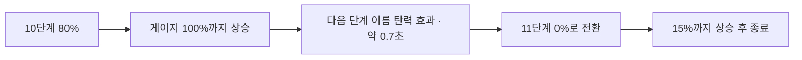

# 생성 화면 유지와 결과 진척도 연출

작성: 2026-09-18

## 1. 생성 화면이 깜빡이던 원인과 수정

`MyBookshelf`는 작업 ID/상태 변경 시 책장을 재조회한다. 기존에는 조회 시작마다 책장 데이터를 지워 이어 읽기와 완료 카드가 잠시 사라졌다. 진행 중과 완료 상태의 생성 카드도 서로 다른 구조/여백을 사용했다.

- 같은 프로필의 기존 책장 데이터를 유지하면서 갱신한다. 실패 시 기존 책장과 오류/재시도 버튼을 함께 보여준다.
- 새 프로필의 응답과 이전 프로필의 응답은 섞지 않는다. effect 정리와 요청 순번으로 오래된 응답을 버린다.
- 카드, 종이인형극, 제목, 단계 문구, 보조 문구, 버튼 영역을 같은 DOM 구조로 유지한다. 단계 이름을 key로 사용하지 않는다.
- 문구/버튼 공간을 미리 확보해 단계 변경과 완료 버튼 등장에 따른 높이 변화를 줄인다. 사용자 일시정지 상태도 유지된다.
- 현재 화면에서 진행을 관찰한 작업이 완료됐지만 책장 갱신이 아직 끝나지 않았다면, 같은 카드에서 책장 정리 문구를 보여준다. 성공 응답 이후 최신 미열람 동화로 연결한다.
- 처음 화면에 들어왔을 때의 오래된 완료 작업만으로 카드를 만들지 않는다. 진행 작업도 미열람 동화도 없으면 카드는 숨긴다.
- 완료 직후 조회가 실패하면 준비 상태와 재시도 안내를 유지한다. 새로고침/재진입 또는 재시도로 복구 가능하다.

파일: `components/my-bookshelf.tsx`, `components/workpad/story-generation-card.tsx`, 대응 CSS module.

## 2. 결과 애니메이션

서버 응답의 `level`, `achievement`, `delta`를 그대로 사용한다. 점수 계산·서버 저장·API 규격은 변경하지 않는다.

```text
이전 레벨 = 소수 두 자리 반올림(결과 level - delta)
이전 단계 = 이전 레벨의 정수 부분
이전 퍼센트 = 소수 부분 × 100
```

예: `level=11.15`, `delta=0.35`, `achievement=15`라면:



- 시작 수치 약 0.32초 → 증가 약 0.95초 → 승급 강조 약 0.7초 → 전환 약 0.16초 → 남은 증가 약 0.95초. 한 단계 승급은 약 3.08초다.
- 단계 안에서 증가하면 이전 퍼센트부터 새 퍼센트까지 바로 이동한다.
- `delta=null`인 최초 측정은 결과 단계에서 0%→결과 퍼센트. 이전 단계/승급을 가정하지 않는다.
- 하락 결과는 수치만 차분하게 감소하며 승급 효과를 사용하지 않는다.
- 최고 20단계는 100%를 유지한다. 여러 단계를 건너뛰는 과거 기록도 연출 전체가 길어지지 않도록 시간을 제한한다.
- 화면 밖/숨겨진 탭에서는 RAF 시간을 멈추고, 다시 보이면 이어 간다. 시스템의 동작 줄이기 설정에서는 최종 값만 표시한다.
- 페이지 이동 버튼은 애니메이션 종료를 기다리지 않고 사용할 수 있다. 다른 결과로 바뀌거나 화면을 떠나면 RAF/observer/listener를 정리한다.
- 저장된 결과를 다시 열어도 당시 변화량을 재생하며 현재 프로필 레벨을 다시 올리지 않는다.

파일: `lib/progress-plan.ts` (순수 타임라인 계산), `components/workpad/result-progress.tsx` (수명/재생), CSS module, `literacy-result.tsx` (공용 결과지 연결).

## 3. 검증

- TypeScript 검사, 프로덕션 빌드 통과.
- 순수 타임라인 5건: 같은 단계, 승급 순서, 최고 단계, 최초 측정, 변화 없음/하락/정수 경계/큰 변화.
- 기존 생성 추적기와 책 상태 테스트 통과.
- 합성 브라우저 데이터로 데스크톱 1440px/모바일 390px 확인. 외부 운영/유료 API 요청은 차단.
- 책장 응답 1.3초 지연, queued→running→assets→completed, 오류/재시도에서도 카드·극장·기존 책 DOM 동일성, 높이 유지 확인. 극장 수동 일시정지도 유지.
- 오래된 완료 작업+미열람 없음에서 카드 숨김 확인.
- 실제 브라우저에서 80→100→단계 강조→다음 단계15%, 모바일 가로 넘침 없음, reduced-motion 즉시 완료 및 페이지 오류 0건 확인.

## 4. 배포

프론트만 배포한다. 새 환경변수·DB 마이그레이션·Render 재배포는 필요 없다. `통신규격.md` 변경 대상인 API 형식 변경도 없다.
