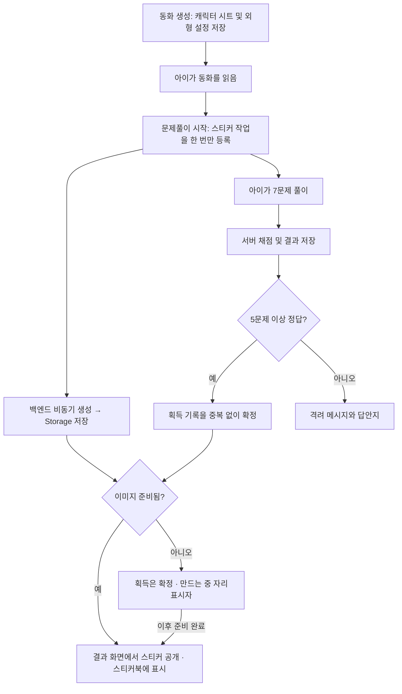

# 동화 캐릭터 스티커북 설계안

작성: 2026-09-18. **설계만 작성했으며 아직 생성·저장·지급 기능은 구현하지 않았다.**

## 제안 요약

동화의 캐릭터를 수집하는 경험은 이야기와 문제풀이를 연결하기 좋다. 추천하는 첫 버전은 **동화당 스티커 1장, 문제풀이 시작 시 이미지 준비, 서버 채점에서 5문제 이상 정답이면 지급**이다. 생성이 늦어도 결과 화면은 기다리게 하지 않고 ‘스티커를 만들고 있어요’ 자리표시자를 제공한다.

이미지 완성과 보상 획득은 서로 다른 상태다. 이미지를 만들었다고 지급되는 것도 아니고, 지급이 확정됐다고 이미지가 완성된 것도 아니다. 두 상태를 분리하면 API 지연·재배포·재시도에서도 획득 기록을 보존할 수 있다.

## 현재 구현에서 확인한 사실

- `backend_test/generation/graph.py`의 `make_art_graph()`는 캐릭터 시트를 생성하고 이를 표지·컷 이미지 요청의 참조로 사용한다.
- 시트 바이트는 `ArtState.sheet`에만 있으며 **현재 Storage/최종 동화 JSON에 보존하지 않는다.**
- 컷 이미지 옵션이 꺼져 있으면 시트를 만들지 않고 표지만 생성한다. 시트가 항상 있다는 전제로 개발하면 안 된다.
- 최종 동화에는 표지/컷 URL이 저장되지만, 초안의 `characters`, `visual_style`도 현재 최종 응답에 보존하지 않는다.
- 퀴즈 생성 경로는 7문항을 검증한다. 퀴즈가 필요 없는 동화 또는 생성 실패로 퀴즈가 없는 동화도 있다.
- 채점은 서버의 `finish_assessment`로 확정되며 결과 기록을 저장한다. 프론트의 정답 개수로 지급 여부를 판단하지 않는다.

## 권장 흐름

DB에 작업을 넣는 것만으로 이미지가 만들어지지는 않는다. DB 작업을 가져와 원격 이미지 API를 실행하는 소비 루프가 필요하다. 현재 운영 방향대로 **백엔드 내부에서 제한된 동시성으로 처리**하되, 작업 상태는 DB에 보존해 프로세스 재시작 후 복구한다. 별도 Render 워커나 로컬 이미지 모델 설치를 전제로 하지 않는다.

## 생성 시점과 비용의 절충

| 시점 | 장점 | 비용/지연 |
|---|---|---|
| 동화 생성 중 | 읽기 종료 전에 준비될 여유가 큼 | 읽지 않거나 문제를 풀지 않는 책도 생성 비용 발생. 본문 생성 경쟁도 늘어남 |
| **문제풀이 시작 시 — 추천** | 풀이 시간 동안 이미지를 준비하고 본문 생성 지연을 피함 | 5개 미만 정답 또는 중도 이탈에도 이미지 비용 발생 가능 |
| 5개 이상 정답 확정 후 | 지급할 스티커만 생성하므로 낭비를 줄임 | 결과 화면에서 자리표시자를 볼 가능성이 높음 |

풀이 종료까지 이미지가 나온다고 보장할 수는 없다. 이미지 작업은 읽기/퀴즈/채점 응답을 막지 않는다. 첫 버전에서는 준비 시점을 설정으로 바꿀 수 있게 하고, 실제 준비 완료율과 호출 비용을 보고 조정한다. 아직 유료 호출이나 실측은 하지 않았다.

## 먼저 필요한 자산 저장

1. 시트를 생성한 직후 전용 Storage 경로에 보존한다. 외형 설정과 `visual_style`도 버전과 함께 저장한다.
2. 영구 데이터에는 만료되는 서명 URL 대신 Storage의 bucket/object path를 보관한다. 클라이언트에는 소유권 확인 후 열람 URL을 제공한다.
3. 이미지 옵션을 끈 책/기존 책: 우선 기존 표지를 참조해 스티커를 만들 수 있지만 원래 시트와 동일한 재현은 보장하지 않는다. 표지도 없으면 준비된 공용 참여 스티커를 쓰거나 지급 이미지 준비를 보류하는 정책이 필요하다.
4. 정확한 캐릭터 재현을 요구한다면 새 책은 외형 설정을 반드시 보존하고, 시트가 없을 때만 시트를 추가 생성한다. 추가 호출 비용이 생긴다.
5. 스티커는 한 캐릭터, 단순 배경, 넉넉한 외곽 여백, 글자 없음으로 생성한다. 투명 배경은 모델 결과를 검증한 경우에만 사용하며, 실패하면 종이색 배경과 CSS 외곽선으로 일관된 모양을 제공한다.

## 데이터 구조 초안

**아래 테이블/필드는 제안이며 아직 DB에 없다.**

### `story_sticker_assets` — 이미지 작업과 결과

- `id`, `story_id`, `owner_user_id`, `profile_id`
- `asset_version`, `character_sheet_path`, `image_path`, `thumbnail_path`
- `status`: `queued / running / ready / failed`
- `attempts`, `next_retry_at`, `lease_until`, `lease_token`, `error_code`
- `created_at`, `updated_at`
- `UNIQUE(story_id, asset_version)`로 동일 스티커 생성 작업 중복 방지

### `profile_stickers` — 획득 기록

- `id`, `owner_user_id`, `profile_id`, `story_id`, `source_result_id`, `asset_id`
- `earned_at`, `title_snapshot`, 선택적으로 스티커북 배치 좌표/페이지
- `UNIQUE(profile_id, story_id)`로 책당 한 번만 지급

획득 여부는 별도 `pending` 보상으로 남발하지 않고, 조건 충족 후에만 획득 행을 만든다. 획득 행이 있고 이미지 자산이 `queued/running/failed`라면 UI에서 자리표시자를 보여준다.

## 정확성·복구 규칙

- 서버가 저장한 해당 동화의 독후 채점 결과만 사용한다. 배치고사/재측정에는 동화 캐릭터 보상을 지급하지 않는다.
- 첫 버전은 동화당 1장. 동일 결과 재조회·제출 재전송·여러 탭에서도 추가 지급하지 않는다.
- 채점 저장과 지급 확정은 가능한 한 동일 DB 트랜잭션/RPC에서 처리한다. 분리한다면 결과 ID 기반의 영속 작업과 누락 보정 절차를 둔다.
- 저장된 동화 퀴즈 수가 5개보다 작거나 퀴즈가 없는 경우에는 현재 기준을 충족할 수 없다. 첫 버전은 퀴즈 보상 대상에서 제외하고, 저단계 아이를 위한 별도 완독 참여 스티커는 후속 정책으로 결정한다.
- 기존 동화의 이미 확정된 점수는 사용자가 반복 조회한다고 변하지 않는다. 5개 미만인 기존 기록으로 재도전 지급까지 허용하려면 별도의 재도전 회차 정책이 필요하다.
- 작업 획득은 원자적으로 처리한다. lease 만료 후 재시작 시 복구하고, 이전 실행자의 늦은 완료는 lease token으로 거부한다.
- 공급자 호출 타임아웃은 성공 여부가 불명확할 수 있다. 무한 재시도 대신 횟수 제한/지연 재시도와 결정적 저장 경로를 쓴다. 중복 과금 가능성은 모니터링한다.
- 소유자·프로필 범위로 DB/Storage 접근을 제한한다. 새 테이블에는 RLS를 적용하되 기존 테이블의 RLS 보류 결정과 분리한다.
- 동화 삭제 시 **이미 획득한 스티커는 남기는 정책을 추천**한다. 제목 스냅샷/스티커 이미지는 유지하고, 원본 동화 FK는 nullable 또는 별도 식별자 스냅샷으로 설계한다. 미획득 작업은 취소/정리하며 실행 중 삭제 경쟁도 처리한다. 계정/프로필 삭제 시에는 함께 삭제한다.

## UI

- 결과지: ‘도깨비 스티커를 받았어요!’ + 실물 스티커 또는 종이색 실루엣과 ‘만드는 중’. 실패 시 획득 기록은 유지하고 재시도 안내만 제공한다.
- 프로필 대시보드: 작은 ‘내 스티커북’ 진입점. 학습 단계 게이지와 보상 수집을 혼동하지 않게 분리한다.
- 스티커북: 획득 날짜순 기본 배치, 이미지 지연/실패 상태 표시. 자유 드래그 배치는 다음 버전으로 미뤄 첫 구현 범위를 줄인다.
- 결과지에 머무르는 동안만 제한된 횟수로 상태를 조회하고 숨은 탭에서는 중지한다. 서버 생성은 페이지 이동과 관계없이 계속된다.

## 구현 순서

1. 캐릭터 시트/외형 설정 저장, 기존 책·이미지 미선택 책 처리 정책 확정.
2. 자산 작업/획득 테이블, 소유권 정책, 중복 방지, 재시작 복구 구현.
3. 서버 채점과 지급 확정 연결. 위조 입력·중복 제출·동화 삭제·생성 실패 검증.
4. 이미지 API를 모의 객체로 두고 자리표시자→완료/실패 전환과 스티커북 구현.
5. 별도로 정한 이미지 예산 안에서 소규모 실측 후 운영 활성화. 첫 버전은 생성 병렬도 1로 제한하고 본문 생성 부하를 우선한다.
