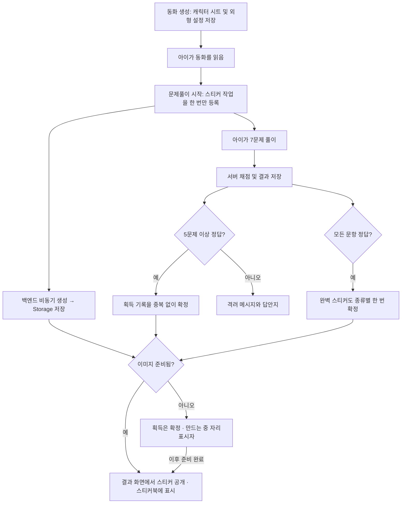

> 2026-09-18 구현 완료 범위는 [스티커북 구현 명세](STICKER_BOOK_IMPLEMENTATION.md)를 참조하세요. 아래는 구현 전 설계 기록이며 현재 동작은 구현 명세가 우선합니다.

# 동화 캐릭터 스티커북 설계안

작성: 2026-09-18. **설계만 작성했으며 아직 생성·저장·지급 기능은 구현하지 않았다.**

## 제안 요약

동화의 캐릭터를 수집하는 경험은 이야기와 문제풀이를 연결하기 좋다. **5문제 이상 정답이면 기본 스티커, 전부 정답이면 추가 완벽 스티커를 각각 책당 한 번 지급**하는 구성을 제안한다. 재도전에서도 아직 받지 않은 보상을 받을 수 있다. 스티커에는 동화 속 등장인물이 주인공에게 건네는 짧은 인사말을 함께 보존한다. 생성이 늦어도 결과 화면은 기다리게 하지 않고 ‘스티커를 만들고 있어요’ 자리표시자를 제공한다.

이미지 완성과 보상 획득은 서로 다른 상태다. 이미지를 만들었다고 지급되는 것도 아니고, 지급이 확정됐다고 이미지가 완성된 것도 아니다. 두 상태를 분리하면 API 지연·재배포·재시도에서도 획득 기록을 보존할 수 있다.

## 현재 구현에서 확인한 사실

- `backend_test/generation/graph.py`의 `make_art_graph()`는 캐릭터 시트를 생성하고 이를 표지·컷 이미지 요청의 참조로 사용한다.
- 시트 바이트는 `ArtState.sheet`에만 있으며 **현재 Storage/최종 동화 JSON에 보존하지 않는다.**
- 컷 이미지 옵션이 꺼져 있으면 시트를 만들지 않고 표지만 생성한다. 시트가 항상 있다는 전제로 개발하면 안 된다.
- 최종 동화에는 표지/컷 URL이 저장되지만, 초안의 `characters`, `visual_style`도 현재 최종 응답에 보존하지 않는다.
- 퀴즈 생성 경로는 7문항을 검증한다. 퀴즈가 필요 없는 동화 또는 생성 실패로 퀴즈가 없는 동화도 있다.
- 채점은 서버의 `finish_assessment`로 확정되며 결과 기록을 저장한다. 프론트의 정답 개수로 지급 여부를 판단하지 않는다.

## 권장 흐름

DB에 작업을 넣는 것만으로 이미지가 만들어지지는 않는다. DB 작업을 가져와 원격 이미지 API를 실행하는 소비 루프가 필요하다. 현재 운영 방향대로 **백엔드 내부에서 제한된 동시성으로 처리**하되, 작업 상태는 DB에 보존해 프로세스 재시작 후 복구한다. 별도 Render 워커나 로컬 이미지 모델 설치를 전제로 하지 않는다.

## 생성 시점과 비용의 절충

| 시점 | 장점 | 비용/지연 |
|---|---|---|
| 동화 생성 중 | 읽기 종료 전에 준비될 여유가 큼 | 읽지 않거나 문제를 풀지 않는 책도 생성 비용 발생. 본문 생성 경쟁도 늘어남 |
| **문제풀이 시작 시 — 추천** | 풀이 시간 동안 이미지를 준비하고 본문 생성 지연을 피함 | 5개 미만 정답 또는 중도 이탈에도 이미지 비용 발생 가능 |
| 5개 이상 정답 확정 후 | 지급할 스티커만 생성하므로 낭비를 줄임 | 결과 화면에서 자리표시자를 볼 가능성이 높음 |

풀이 종료까지 이미지가 나온다고 보장할 수는 없다. 이미지 작업은 읽기/퀴즈/채점 응답을 막지 않는다. 첫 버전에서는 준비 시점을 설정으로 바꿀 수 있게 하고, 실제 준비 완료율과 호출 비용을 보고 조정한다. 아직 유료 호출이나 실측은 하지 않았다.

## 먼저 필요한 자산 저장

1. 시트를 생성한 직후 전용 Storage 경로에 보존한다. 외형 설정과 `visual_style`도 버전과 함께 저장한다.
2. 영구 데이터에는 만료되는 서명 URL 대신 Storage의 bucket/object path를 보관한다. 클라이언트에는 소유권 확인 후 열람 URL을 제공한다.
3. 이미지 옵션을 끈 책/기존 책: 우선 기존 표지를 참조해 스티커를 만들 수 있지만 원래 시트와 동일한 재현은 보장하지 않는다. 표지도 없으면 준비된 공용 참여 스티커를 쓰거나 지급 이미지 준비를 보류하는 정책이 필요하다.
4. 정확한 캐릭터 재현을 요구한다면 새 책은 외형 설정을 반드시 보존하고, 시트가 없을 때만 시트를 추가 생성한다. 추가 호출 비용이 생긴다.
5. 스티커 그림은 한 캐릭터, 단순 배경, 넉넉한 외곽 여백, 글자 없음으로 생성한다. 인사말은 아래 규칙에 따라 별도 텍스트로 저장하고 말풍선/종이 띠로 합성한다. 투명 배경은 모델 결과를 검증한 경우에만 사용하며, 실패하면 종이색 배경과 CSS 외곽선으로 일관된 모양을 제공한다.

## 등장인물의 한마디

### 표현 원칙

- 화자는 확정된 본문에 실제 등장한 인물 중 주인공과 좋은 경험을 나눈 인물로 고른다. 적절한 인물이 없으면 책방 안내 캐릭터가 읽기 참여를 격려하는 공통 문구를 사용하고, 본문 등장인물인 것처럼 표시하지 않는다.
- 받는 이름은 동화 생성 당시의 **주인공 이름**을 저장한다. 프로필 이름이 나중에 바뀌어도 기존 이야기에 새 이름을 임의로 끼워 넣지 않는다.
- 실제 본문에 근거한 감사·기쁨·응원을 1~2개의 짧은 문장으로 작성한다. 목표는 약 20~45자이며 뜻을 잘라 길이만 맞추지는 않는다. 가능하면 해당 동화의 어휘 단계와 말투를 따른다.
- ‘물리쳤어’, ‘구해 줬어’, ‘함께 노래했어’는 실제로 그 사건이 있을 때만 쓴다. 인사말을 위해 새 사건이나 관계를 만들어내지 않는다.
- 캐릭터가 정답 수를 알고 있는 듯한 대사는 피한다. 정답 수/완벽 보상은 UI의 별도 배지로 표시하고, 캐릭터는 함께한 이야기 경험을 이야기한다.

예시(해당 사건이 실제 본문에 있을 때):

- 토끼: “도란아, 길을 찾아 줘서 고마워! 덕분에 집에 왔어.”
- 도깨비: “도란아, 함께 노래해서 정말 즐거웠어!”
- 호랑이: “도란아, 네가 손을 내밀어 줘서 용기가 났어.”

### 생성·표시 방식

1. 최종 선택된 동화 본문에서 인사말을 만든다. 선택에서 탈락한 초안은 사용하지 않는다.
2. 구조화된 값 `speaker_id`, `speaker_name`, `recipient_name_snapshot`, `message`, `evidence_page_numbers`, `evidence_quote`를 저장한다. 근거는 내부 검증용이며 스티커 앞면에 노출하지 않는다.
3. 화자가 등장하는지와 근거 인용이 원문에 존재하는지 확인하고, 대사가 근거보다 과장된 인과/관계를 주장하지 않는지도 검증한다. 검증 실패 시 짧은 공통 인사로 대체하며 동화나 보상 지급을 막지 않는다.
4. 이미지 모델에는 글자를 그리게 하지 않는다. 캐릭터 이미지와 말풍선 텍스트를 프론트에서 따로 표시해 한글/이름 오류를 줄이고 작은 화면에서도 읽기 쉽게 만든다. 스티커를 열면 큰 그림과 전문을 볼 수 있다. 추후 이미지 저장/다운로드 시에는 검증된 폰트로 서버 또는 캔버스 합성을 한다.
5. 본문 완성 후 기본/완벽 보상 인사말을 작은 비동기 작업 한 번으로 함께 준비하거나, 기존 본문 후처리에 붙인다. 인사말을 위한 고비용 모델의 별도 연속 호출은 우선 도입하지 않는다.

## 재도전과 보상 종류

**확장 정책 제안이며 기존 채점/회차 API는 아직 변경하지 않았다.**

| 조건 | 보상 |
|---|---|
| 유효한 독후 풀이에서 5개 이상 정답 | 기본 ‘이야기 친구’ 스티커 1장 |
| 유효한 독후 풀이에서 전부 정답 | 추가 ‘완벽한 한 권’ 스티커 1장 |
| 이미 해당 종류를 받은 상태에서 재제출/재도전 | 기존 스티커 유지, 중복 지급 없음 |

- 예: 처음 5/7 → 기본 1장, 나중에 재도전 7/7 → 완벽 1장 추가. 처음 3/7 → 없음, 재도전 7/7 → 기본·완벽 각 1장.
- **처음부터 전부 맞혀도 기본·완벽을 함께 지급하는 방식을 추천**한다. 재도전에서만 추가 보상을 주면 첫 만점을 받은 아이가 오히려 불리해지기 때문이다. 두 장은 결과 화면에서 한 번의 획득 연출로 묶는다.
- 완벽 스티커는 같은 캐릭터에 별빛 테두리/포일 장식과 별도 인사말을 더해 구분한다. 첫 버전은 기본 이미지를 재사용해 추가 이미지 API 비용을 피한다. 새 포즈/별도 그림은 후속 옵션이다.
- 재도전은 사용자가 ‘다시 풀기’를 눌렀을 때 새 `attempt_id`로 시작한다. 답안지 조회만으로 새 회차를 만들지 않는다. 기존 결과와 새 결과는 모두 보존하고 문제 기록에서 회차를 구분한다.
- 서버가 해당 회차의 전체 문항 수와 정답을 확인한다. 누락 문항이 있는데 제출한 일부가 모두 맞았다는 이유로 만점을 인정하지 않는다.
- 첫 버전은 같은 동화의 같은 문제로 복습한다. 보기 순서를 바꾸더라도 안정적인 선택지 ID를 유지한다. 새 문제 생성은 별도의 개선 범위다.
- 정답을 이미 확인한 복습으로 레벨을 반복해서 올리지 않도록 **복습 회차는 추가 레벨 상승 없이 스티커·복습 기록만 갱신**하는 정책을 제안한다. 첫 풀이 결과와 복습 결과를 부모 통계에서도 구분한다.
- 기본 스티커가 이미 준비됐으면 재도전마다 이미지나 인사말을 재생성하지 않는다. 미지급/미완성 자산만 기존 작업에 연결한다.

## 데이터 구조 초안

**아래 테이블/필드는 제안이며 아직 DB에 없다.**

### `story_sticker_assets` — 이미지 작업과 결과

- `id`, `story_id`, `owner_user_id`, `profile_id`
- `asset_version`, `character_sheet_path`, `image_path`, `thumbnail_path`
- 기본/완벽 인사말 각각의 화자·주인공 이름 스냅샷·메시지·근거·검증 상태(`messages.friend`, `messages.mastery`)
- `status`: `queued / running / ready / failed`
- `attempts`, `next_retry_at`, `lease_until`, `lease_token`, `error_code`
- `created_at`, `updated_at`
- `UNIQUE(story_id, asset_version)`로 동일 스티커 생성 작업 중복 방지

### `profile_stickers` — 획득 기록

- `id`, `owner_user_id`, `profile_id`, `story_id`, `source_result_id`, `asset_id`
- `reward_kind`: `friend / mastery`, `earned_at`, `title_snapshot`, 인사말 스냅샷, 선택적으로 스티커북 배치 좌표/페이지
- `UNIQUE(profile_id, story_id, reward_kind)`로 책당 종류별 한 번만 지급. 기본/완벽은 같은 이미지 자산을 참조할 수 있다.

획득 여부는 별도 `pending` 보상으로 남발하지 않고, 조건 충족 후에만 획득 행을 만든다. 획득 행이 있고 이미지 자산이 `queued/running/failed`라면 UI에서 자리표시자를 보여준다.

## 정확성·복구 규칙

- 서버가 저장한 해당 동화의 독후 채점 결과만 사용한다. 배치고사/재측정에는 동화 캐릭터 보상을 지급하지 않는다.
- 동화당 기본/완벽 각 1장. 동일 결과 재조회·제출 재전송·여러 탭에서도 같은 종류를 추가 지급하지 않는다.
- 채점 저장과 지급 확정은 가능한 한 동일 DB 트랜잭션/RPC에서 처리한다. 분리한다면 결과 ID 기반의 영속 작업과 누락 보정 절차를 둔다.
- 저장된 동화 퀴즈 수가 5개보다 작거나 퀴즈가 없는 경우에는 기본 보상 기준을 충족할 수 없다. 첫 버전은 두 종류 모두 5문항 이상인 정상 독후 퀴즈를 대상으로 제한하고, 저단계 아이를 위한 별도 완독 참여 스티커는 후속 정책으로 결정한다.
- 기존 동화의 이미 확정된 점수는 사용자가 반복 조회한다고 변하지 않는다. 위 재도전 정책을 적용하려면 회차 종류·재도전 시작·중복 제출 방지·복습 채점 경로를 먼저 구현해야 한다. 과거 결과 일괄 소급 지급은 별도 정책으로 둔다.
- 작업 획득은 원자적으로 처리한다. lease 만료 후 재시작 시 복구하고, 이전 실행자의 늦은 완료는 lease token으로 거부한다.
- 공급자 호출 타임아웃은 성공 여부가 불명확할 수 있다. 무한 재시도 대신 횟수 제한/지연 재시도와 결정적 저장 경로를 쓴다. 중복 과금 가능성은 모니터링한다.
- 소유자·프로필 범위로 DB/Storage 접근을 제한한다. 새 테이블에는 RLS를 적용하되 기존 테이블의 RLS 보류 결정과 분리한다.
- 동화 삭제 시 **이미 획득한 스티커는 남기는 정책을 추천**한다. 제목 스냅샷/스티커 이미지는 유지하고, 원본 동화 FK는 nullable 또는 별도 식별자 스냅샷으로 설계한다. 미획득 작업은 취소/정리하며 실행 중 삭제 경쟁도 처리한다. 계정/프로필 삭제 시에는 함께 삭제한다.

## UI

- 결과지: ‘도깨비 스티커를 받았어요!’ + 캐릭터와 한마디, 또는 종이색 실루엣과 ‘만드는 중’. 완벽 보상은 별빛 장식으로 구분한다. 실패 시 획득 기록은 유지하고 재시도 안내만 제공한다.
- 프로필 대시보드: 작은 ‘내 스티커북’ 진입점. 학습 단계 게이지와 보상 수집을 혼동하지 않게 분리한다.
- 스티커북: 획득 날짜순 기본 배치, 이미지 지연/실패 상태 표시. 자유 드래그 배치는 다음 버전으로 미뤄 첫 구현 범위를 줄인다.
- 결과지에 머무르는 동안만 제한된 횟수로 상태를 조회하고 숨은 탭에서는 중지한다. 서버 생성은 페이지 이동과 관계없이 계속된다.

## 구현 순서

1. 캐릭터 시트/외형 설정 저장, 기존 책·이미지 미선택 책 처리 정책 확정.
2. 자산 작업/획득 테이블, 소유권 정책, 중복 방지, 재시작 복구 구현.
3. 등장인물의 한마디 구조화 생성/근거 검증 및 말풍선 표시 구현.
4. 재도전 회차와 서버 채점/종류별 지급 확정 연결. 처음 만점·재도전 만점·일부 문항 누락·레벨 중복 상승·중복 제출·동화 삭제·생성 실패 검증.
5. 이미지 API를 모의 객체로 두고 자리표시자→완료/실패 전환과 스티커북 구현.
6. 별도로 정한 이미지 예산 안에서 소규모 실측 후 운영 활성화. 첫 버전은 생성 병렬도 1로 제한하고 본문 생성 부하를 우선한다.
