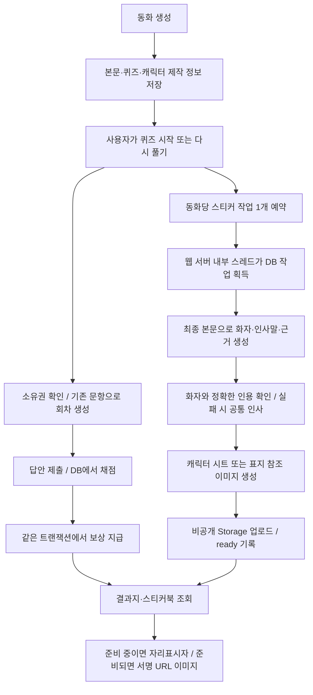

> 시각 디자인은 이후 [비주얼 개선 명세](DASHBOARD_VISUAL_REFRESH.md)로 갱신했습니다. 아래의 데이터·보상·운영 규칙은 유지합니다.

# 대시보드와 스티커북 구현 명세

기준: 2026-09-18. 이전 `스티커북_설계안.md`를 실제 구현한 범위와 운영 조건을 기록한다.

## 1. 화면

- 대시보드 상단은 읽기 진척도 / 모험 계속하기 / 스티커북의 세로형 라운드 카드 3개다.
- 진척도는 끝이 둥근 SVG 도넛, 씨앗·새싹·나무·숲 SVG 그림, 현재 등급과 퍼센트로 표시한다. 아래에 문해력 재측정, 마지막 문제 기록 링크를 둔다. 기존 별도 결과 카드는 제거했다.
- 당일 재측정 완료 시 기존 비활성 버튼과 크기를 바꾸지 않는 안내 툴팁을 유지한다.
- 모험 계속하기는 서버 bookshelf의 resume을 사용한다. 읽던 책이 없으면 책장으로 안내한다.
- 스티커북 바로가기는 CSS 제본 표지와 기존 종이인형 WebP를 재사용한다. 이번 UI 때문에 새 이미지 생성 비용은 발생하지 않는다.
- 모바일에서는 3개 카드를 가로 스와이프로 볼 수 있다. 문서 전체가 가로로 밀리지 않도록 카드 행 안에서만 스크롤한다.
- `/stickers`는 선택 프로필의 스티커를 보여준다. 획득 날짜, 동화 제목, 화자, 한마디, 보상 종류가 표시된다. 동화 링크로 이동 후 이전으로 돌아오면 스티커북으로 복귀한다.

## 2. 보상 규칙

| 조건 | 지급 |
|---|---|
| 문항이 있는 독후 퀴즈에서 전부 정답 | 완벽한 한 권(mastery) 한 장 |
| 하나라도 오답 | 지급 없음 |
| 재도전에서 처음 만점 | mastery 한 장 |
| 같은 답안 재전송 / 같은 책 반복 만점 | 추가 지급 없음 |
| 배치고사·체크리스트 / 빈 퀴즈 | 지급 없음 |

복습은 결과와 보상만 저장하며 프로필 단계는 변경하지 않는다. 부모님 영역별 통계에서도 복습 결과를 제외하여 같은 문항을 반복해서 통계가 부풀지 않게 했다. 최근 결과 목록에는 복습 기록을 남긴다.

기존 결과 전체를 자동으로 소급 지급하지 않는다. 예전 동화는 결과지의 다시 풀기를 통해 획득할 수 있다. 동화 삭제 후에도 이미 획득한 스티커와 당시 제목·인사말은 보존한다. 원본이 삭제된 경우 제목 링크만 없앤다.

## 3. 처리 순서

퀴즈 시작 시 미리 준비하므로 문제를 푸는 동안 이미지 생성이 진행된다. 보상을 받지 못하더라도 이미 시작한 이미지 호출 비용은 발생할 수 있다. **결과 제출은 이미지 생성을 기다리지 않는다.** 동화마다 정상 처리 시 인사말 텍스트 호출 1회 + 이미지 호출 1회다. mastery는 같은 그림에 금색 장식과 다른 인사말을 사용하여 추가 그림을 생성하지 않는다. 실패 재시도 및 기존 공급자 내부 재시도가 있으므로 실제 유료 호출이 항상 정확히 1회인 것은 아니다.

## 4. 저장 구조와 보안

마이그레이션: `backend_test/sql/20260918_sticker_book.sql` → `backend_test/sql/20260918_mastery_only_stickers.sql`. 후속 마이그레이션은 과거 friend 행을 삭제하지 않고 지급·목록에서 제외한다. 기존 mastery의 획득일·ID·이미지는 유지한다.

- `story_sticker_assets`: 동화당 제작 작업, 본문/제작 정보 스냅샷, 상태, 그림 경로, 인사말, 근거, 재시도와 작업 임대 정보.
- `profile_stickers`: 프로필별 획득 기록. `UNIQUE(profile_id, story_id, reward_kind)`로 중복 지급 방지.
- `assessment_attempts.is_practice`, `quiz_results.is_practice`: 복습 회차 구분.
- 보상은 `finish_assessment` 내부에서만 지급한다. 클라이언트가 정답 수나 지급할 종류를 보내지 않는다. `award_story_stickers` 직접 실행 권한은 제공하지 않는다.
- 독후 문항은 저장된 동화의 quizzes를 읽는다. 클라이언트 RPC에 전달된 대체 문항을 신뢰하지 않는다.
- 새 테이블에는 RLS/최소 권한을 적용했다. 기존 users/profiles/saved_stories의 RLS 설정은 변경하지 않았다.
- 이미지와 캐릭터 시트는 Supabase **비공개 stickers 버킷**에 저장한다. API가 소유권 확인 후 1시간 서명 URL을 일괄 발급한다. 내부 image_path는 목록 응답에서 제거한다.
- 외부 URL을 임의로 가져오지 않는다. 참조 시트는 같은 story_id 폴더만, 표지는 같은 Supabase의 covers 버킷만 허용하며 리다이렉트는 따르지 않는다. 다운로드 상한은 8MB다.
- 프로필/계정 삭제 시 테이블 행은 FK cascade로 삭제된다. Storage의 고아 객체 자동 정리 작업은 이번 범위에 포함하지 않았다.

새 동화의 `content.generation`에는 `characters`, `visual_style`, `protagonist_name`, `character_sheet_path`를 추가 저장한다. 기존에 생성하는 시트를 업로드해 재사용하며 별도 시트 생성 호출을 늘리지 않았다. 시트가 없는 기존/이미지 미생성 동화는 허용된 표지를 참조한다. 이미지가 없으면 텍스트 외형만 사용하므로 시각적 일관성에는 한계가 있다.

## 5. 인사말 검증

최종 본문과 주인공 이름, 캐릭터 목록을 텍스트 모델에 제공한다. 주인공 본인이 아닌 다른 등장인물의 짧고 따뜻한 말을 생성한다. 구조화 필드는 speaker, appearance, message, mastery_message, evidence_page, evidence_quote다.

코드는 인용문이 해당 페이지에 실제 존재하는지, 화자가 본문에 나오는지, 주인공 자신이 아닌지 확인한다. 캐릭터 목록이 있으면 해당 목록의 이름/외형을 사용한다. 실패하면 ‘책방 친구’의 공통 인사를 사용한다. 이는 정확 인용·이름 검증이며, 인사말과 사건의 의미 관계 전체를 독립 모델로 재검증하는 기능은 아니다. 그림에는 문자를 그리지 않고 웹 UI에서 한글을 표시한다.

## 6. 서버 재시작·비용·운영

- 별도 Render Worker 서비스 없이 웹 서버의 내부 스레드가 처리한다. 로컬 AI/Kiwi 모델은 로드하지 않는다.
- DB 잠금과 임대를 통해 여러 프로세스에서도 스티커 작업은 전역 1개씩 획득한다. 기존 이미지 공급자의 프로세스당 동시 호출 상한 2개도 공유한다.
- 평상시 8초 폴링, DB 장애 시 30초 대기. 대기 중 HTTP 클라이언트를 재사용한다.
- 임대 10분, 작업 최대 2회 시도. 오류는 2분 뒤 재시도한다. 서버 재시작 시 만료된 임대를 다시 가져온다. claim_token이 맞는 실행만 완료 처리하며 이미지 경로도 claim별로 분리한다.
- 2회 실패 후 failed로 남는다. 화면 새로고침 버튼은 조회만 수행하며 유료 재생성을 예약하지 않는다. 별도 운영자 재시도 UI는 미구현이다.
- 프론트는 준비 중 목록을 10초마다 최대 12회 자동 확인한다. 숨은 탭에서는 중단하며 복귀·수동 새로고침으로 다시 확인한다. 24개씩 더 보기, 지연 이미지 로딩을 사용한다. 추가로 펼친 과거 페이지는 수동 새로고침 후 다시 펼쳐 최신 상태를 확인할 수 있다.
- **새 필수 환경변수 없음.** 기존 Supabase 서비스 키 및 Gemini/API 설정을 사용한다. 선택적으로 `STICKERS_ENABLED=false`를 설정하면 소비기만 멈춘다. 획득 기록/작업 예약/API 조회는 유지된다.
- DB 마이그레이션 → 백엔드 배포 → 프론트 배포 순서다. 기존 테이블/책을 삭제하거나 과거 유료 이미지를 일괄 생성하지 않는다.

## 7. API 및 파일 안내

- `GET /api/v1/stickers`: 프로필별 획득 목록, 선택적 동화 필터, 페이지네이션.
- `POST /api/v1/assessments/story/{story_id}/practice`: 복습 시작/미완료 회차 재사용.
- `GET /api/v1/assessments/attempts/{attempt_id}`: 새로고침 복원용 읽기 전용 회차 조회.
- 기존 결과 응답에 `story_id`, `is_practice` 추가. 상세 형식은 프론트 `통신규격.md` 참조.

| 파일 | 역할 |
|---|---|
| front/components/dashboard-summary.tsx, .module.css | 3개 상단 카드, 원형 진척도 |
| front/app/stickers/page.tsx | 프로필 복원과 스티커북 페이지 |
| front/components/sticker-collection.tsx, sticker-book.module.css | 결과지/앨범 공통 보상 표시 |
| front/components/result-page.tsx, book-reader-page.tsx | 재도전 진입과 새로고침 복원 |
| front/lib/stickers.ts, bookshelf.ts | 목록/회차 API |
| back/backend_test/generation/stickers.py | 비공개 저장·서명·근거 확인·작업 소비 |
| back/backend_test/generation/graph.py, models.py | 캐릭터 시트 및 제작 정보 보존 |
| back/backend_test/main.py, db_manager.py | 인증 API와 수명 관리 |
| back/backend_test/sql/20260918_sticker_book.sql | 테이블/RPC/보상 트랜잭션 |
| back/backend_test/tests/test_stickers.py | 외부 호출을 모의한 회귀 검증 |

## 8. 검증과 남은 범위

- 스티커 Python 9개, 기존 생성 14개/인증 25개/책장 8개/내장 실행기 8개 회귀 검증 통과.
- Supabase 합성 데이터 트랜잭션 후 롤백: 위조 문항 무시, 미완성 답안 거부, 중복 지급 방지, 복습 단계 불변, 소유권/RLS, 페이지네이션, 재시작 복구, 오래된 claim 거부, 동화 삭제 후 획득 기록 유지 검증. 실제 사용자 데이터 변경 없음.
- 실제 Storage에 작은 합성 PNG 업로드 → 일괄 서명 조회 → 공개 접근 차단 → 비공개 참조 다운로드 → 검증 객체 삭제 완료.
- TypeScript/프로덕션 빌드, Playwright 데스크톱·모바일: 3카드/도넛, 앨범 이동, 준비 중→완료, 원본 동화 복귀, 결과지 보상, 재도전 새로고침, 빈 목록·오류 재조회 검증.
- 이번 검증은 실제 유료 모델을 호출하지 않았다. 생성 경로는 모의 테스트이며 실제 스티커 그림의 미감과 인사말 품질은 배포 후 실제 사용 결과로 확인해야 한다.
- 프로필 꾸미기·크레파스 편집기는 아직 미구현이다. 이후 획득한 `profile_stickers.id`를 참조하고 배치 좌표/회전/크기만 별도 저장하면 이미지를 재생성하지 않고 재사용할 수 있다.
