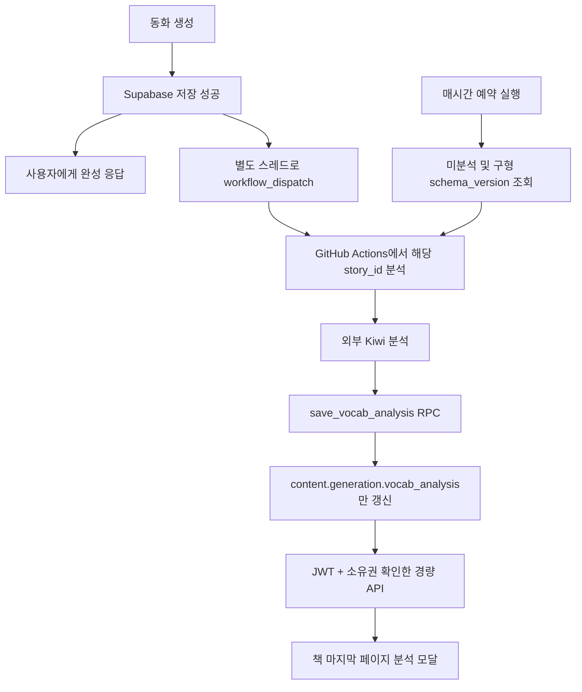

# 동화 수준 확인하기 — 구현 및 운영

## 사용자 화면

- 저장된 동화의 책 마지막 화면에 **동화 수준 확인하기** 버튼을 둔다. 퀴즈 화면에는 두지 않는다.
- 전체 등장 횟수, 도전 어휘 종류 수와 칩, 표현 어휘 종류 수와 칩을 모달로 표시한다.
- 반복을 포함한 형태소 수와 중복 제거한 단어 종류 수를 구분한다. 형용사/동사는 `포근하` 대신 `포근하다`처럼 기본형으로 표시한다.
- 비율, 적중률, 주입 예시, 또래 순위는 표시하지 않는다. 0개는 정상 결과로 설명한다.
- null/구형 필드 누락/손상 결과는 준비 상태다. 오류는 재시도 버튼으로 구분한다.
- 마지막 화면에 들어왔을 때만 분석 전용 API를 최대 12번, 10초 간격으로 조회한다. 숨은 탭에서는 쉬고, 화면 이탈 시 요청을 취소한다. 이후에는 다시 확인하거나 재방문할 수 있다.
- HTML dialog로 키보드 초점 가두기·Escape 닫기·닫은 뒤 초점 복귀를 제공한다. 회전 애니메이션 복제면 밖에 모달을 하나만 둔다.

## 데이터 흐름



## API

`GET /api/v1/stories/{story_id}/vocab-analysis?profile_id=...`

Supabase Bearer JWT 필수. profile 소유자를 검증하고 story_id와 profile_id를 함께 조회한다.

```json
{
  "status": "ready",
  "analysis": {
    "총_내용형태소_수": 187,
    "상위등급_어휘_목록": ["탐험", "포근하다"],
    "상위등급_어휘_개수": 2,
    "표현_어휘_목록": ["포근하다", "살짝"],
    "표현_어휘_개수": 2
  }
}
```

미완료/구형: `{"status":"pending","analysis":null}`. 401은 인증 없음, 404는 미소유/없는 프로필·동화, 503은 DB/인증 서비스 오류. 본문·이미지·내부 품질 비율은 이 API에 포함하지 않는다.

## 분석 배치

- `.github/workflows/backfill-vocab-analysis.yml`의 `workflow_dispatch.inputs.story_id`를 추가했다. 기존 파일은 입력 없이 수동 실행만 선언되어 있었다.
- 입력값은 shell 문자열에 직접 삽입하지 않고 `STORY_ID` 환경변수와 따옴표를 사용한다.
- 정기 배치는 null뿐 아니라 `schema_version != 2` 또는 누락된 과거 결과도 처리한다. 예시 어휘가 없는 과거 동화도 분석하고 적중률만 null로 둔다.
- 이미 버전 2로 정상 분석된 책의 중복 dispatch는 저장을 반복하지 않는다.
- 분석/저장 실패를 Actions 실패로 반환한다. 미처리분은 다음 배치에서 다시 처리한다.
- 즉시 요청은 실행 완료 보장이 아니다. daemon 스레드는 서버 종료 시 중단될 수 있고 Actions도 대기·실패할 수 있다. 예약 실행도 정확한 1시간 이내 완료를 보장하지 않는다.

## DB 변경

`backend_test/sql/20260917_vocab_analysis.sql`: 배치 전용 `save_vocab_analysis(text,jsonb,jsonb)` 함수.

- service_role에만 실행 권한. 기존 테이블 RLS 설정은 변경하지 않는다.
- 최신 content의 generation.vocab_analysis 경로만 갱신한다. 표지색·이미지·퀴즈·다른 생성 메타데이터 보존.
- 분석 시작 시 본문과 현재 본문이 같을 때만 저장해 수정된 본문에 과거 분석이 붙는 것을 막는다.
- 합성 데이터 ROLLBACK 검증 후 운영 적용했다.

## 함께 복구한 API

최근 main.py 갱신에서 a3ff65c에 있던 책장·읽기 기록·결과 상세·독후 퀴즈 회차 API가 누락되어 운영 OpenAPI에서도 사라진 것을 확인했다. 이 경로와 저장 퀴즈 반환, 서버 회차 채점/결과 원자 저장을 복구하고 새 분석 트리거를 통합했다. 팀원의 최신 level_config와 분석 로직 변경은 유지한다.

## 운영 설정과 확인 범위

- Render 현재 백엔드 서비스: GITHUB_ACTIONS_TOKEN, GITHUB_REPO=doran-doran-ai/doran-doran.
- GitHub Actions Secrets: SUPABASE_URL, SUPABASE_SERVICE_KEY.
- Render에는 Kiwi를 설치/초기화하지 않는다. 웹 main import 시 Kiwi 미로딩을 확인한다.
- 비공개 Actions 실행 이력과 Render 비밀값은 현재 세션에서 조회할 수 없다. 설정 완료 보고와 실제 자동 실행 성공은 구분한다.
- 마지막 연결 확인: 새 동화 생성 후 Actions의 workflow_dispatch 실행 및 성공 여부 확인. 실패 시 토큰이 아닌 실패 단계/오류 메시지만 공유한다.
- 유료 동화/이미지 생성 호출 없이 합성 브라우저 자료와 저장 경로 테스트를 수행한다.

## 관련 파일

- 백엔드: generation/vocab_summary.py, vocab_backfill_trigger.py, vocab_analysis.py, generation/worker.py, scripts/backfill_vocab_analysis.py, main.py, db_manager.py, sql/20260917_vocab_analysis.sql.
- 프론트: lib/vocab-analysis.ts, components/workpad/story-vocabulary.tsx 및 CSS, popup-book.tsx, book-reader-page.tsx.
- 테스트: backend_test/tests/test_vocab_feature.py, front/tests/vocab-analysis.test.cjs, 작업 폴더 vocab-level/ui-check.cjs 및 db-verify.py.


## 검증 결과 (2026-09-17)

- 백엔드: 어휘 기능 9개, 기존 인증 25개, 책장 API 8개, 내부 실행기 8개, 동시 생성 3개 테스트 통과.
- 프론트: 타입 검사/운영 빌드/8개 테스트 파일(러너 12건) 통과.
- 브라우저: 준비→완료 자동 전환, 정상 단어/숫자, 0개, 통신 실패 후 재조회, Escape/초점 복귀, PC/390px/320px, 퀴즈 화면에는 버튼 없음. JS 오류 0건.
- DB: 합성 데이터 롤백 검증 후 함수 적용. 분석 경로만 갱신, 다른 필드 보존, 본문 변경 거부, 배치 전용 권한 확인.
- 실제 Kiwi: 별도 로컬 분석 가상환경에서 기존 동화 3권 분석·저장 성공, 실패 0. 백엔드 실행 가상환경과 Render 의존성은 유지. LLM/이미지 유료 호출 없음.
- GitHub/Render 간 실제 자동 dispatch 완료는 비공개 Actions 이력 접근이 없어 별도 운영 확인이 필요하다.


## 섹션별 선정 기준 설명 (2026-09-18)

- 도전 어휘: “국립국어원 어휘 등급 자료를 바탕으로, 이야기 속 2·3등급 단어를 모았어요.”
- 표현 어휘: “장면이나 마음을 더 생생하게 그려주는 형용사·부사 표현들을 모았어요.”
- 각 제목과 개수 아래, 단어 칩 위에 한 문장으로 표시한다. 모바일에서는 자연스럽게 줄바꿈한다.
- 실제 백엔드는 grade_2/grade_3 조회 결과와 Kiwi 형용사(VA)·부사(MAG) 분류를 각각 중복 제거한다. 또래 사용 빈도나 나이별 상대 난도는 계산하지 않으므로 “또래가 아직 자주 쓰지 않는 단어”로 설명하지 않는다.
- 0개여도 기준 설명은 유지한다. 도전 어휘를 못 찾았다는 사실만 표시하며 동화 전체가 쉽다고 단정하지 않는다. 분석 대기/오류, 개수·칩, 기본형 안내는 유지한다.
- 화면 문구만 변경하며 API·분석 배치·데이터 구조는 변경하지 않는다.
